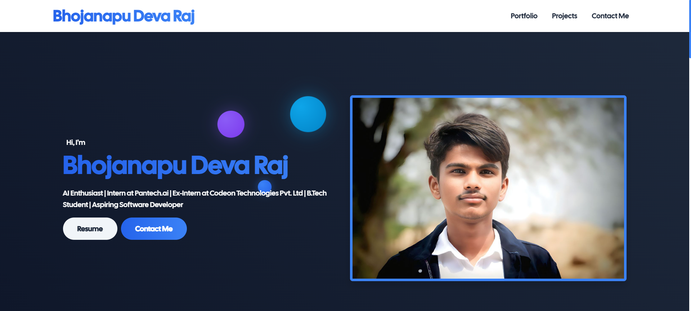

# 👨‍💻 Developer Portfolio

A sleek and responsive personal **portfolio website** to showcase your skills, projects, and contact information. Built with modern web technologies to ensure a fast, clean user experience.

> ⚡ Designed and developed using HTML, CSS, Bootstrap and JavaScript — fully client-side.

---

## 🌟 Features

- 🧑‍💼 About Me section with intro , skills ,Education and Experinces
- 🧰 Project showcases with links
- 📨 Contact form (static)
- 📱 Fully responsive design
- 🎨 Clean, minimal, and professional UI

---

## 🖥️ Tech Stack

- ✅ **HTML5**  
- ✅ **CSS3** [**Bootsrap**]— for styling and responsiveness  
- ✅ **JavaScript** — for interactivity and DOM control  

---

## 📸 Screenshots

| Desktop View | Mobile View |
|--------------|-------------|
|  |  |


---

## 🚀 Live Preview

🔗 [**View Portfolio Live**](https://devarajb049.github.io/Portfolio/)

---

## 📂 How to Use

### 🔧 Steps

1. **Clone the Repository**:
   ```bash
   git clone https://github.com/Devarajb049/Portfolio.git
   cd Portfolio
